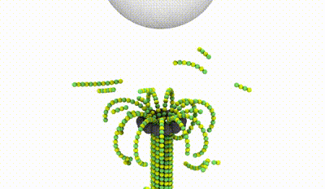

# MADDY - Microtubule Assembly and Disassembly DYnamics

Scientific software package designed to perform Langevin Dynamics simulations of coarse-grained proteins (tubulins), implemented in C++ and GPU-accelerated with CUDA. In the software, I also utilized MPI to be able to run parallel simulations on the nodes with multiple graphics accelerators.



## Usage

1. Copy MT/ to your working folder
2. Download CMake 2.8+
3. Compile - in MT/ folder: 

```bash
# Here you can specify the compiler you want to use
export CC=/usr/bin/gcc-6
export CXX=/usr/bin/g++-6

mkdir build/
cd build/
ccmake ..
# then press 'c' and 'g'.
make
cd ../
```
4. Configure config files in `template/`.
5. Run by shell command:
 
```bash
cd template/
./build/mt config.conf
```

6. Visualize dcd trajectories in VMD
7. PROFIT!
